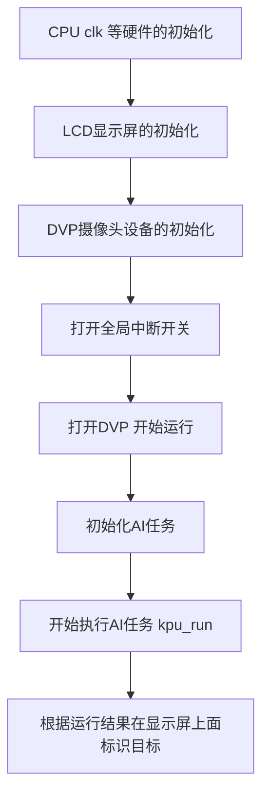
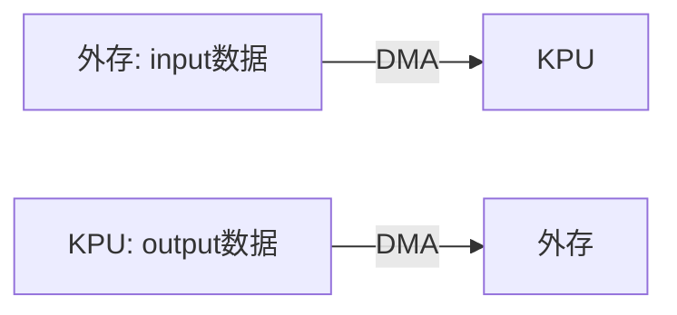
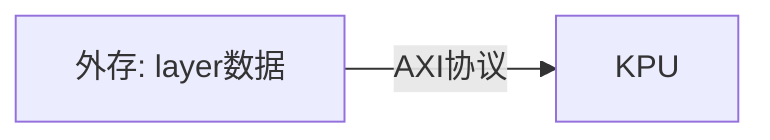
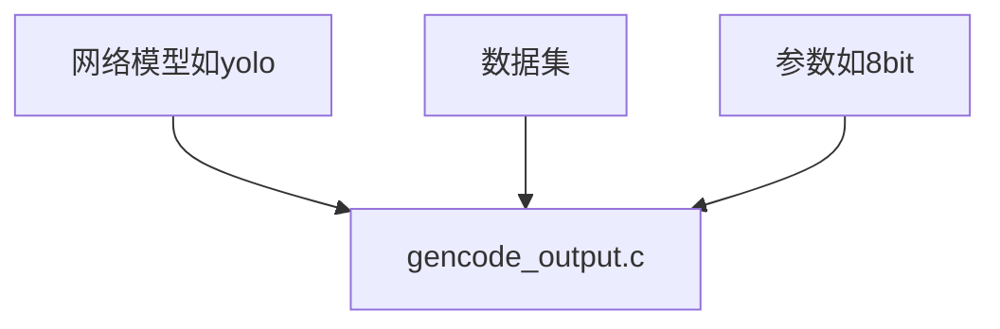

# ----从人脸识别demo分析相关原理和api的使用


# 1. 人脸识别demo的逻辑流程



  


# 2. AI 芯片API简介
> - **kpu_task_init:**
> 初始化 kpu 任务句柄，该函数具体实现在 model compiler 生成的 gencode_output.c 中。
> - **kpu_run:**
> 启动 KPU，进行 AI 运算
> - **kpu_get_output_buf:**
> 获取 KPU 输出结果的缓存
> - **kpu_release_output_buf:**
> 释放 KPU 输出结果缓存
## API特点 : 非常简易、暴露接口很少


# 3. 核心结构体分析: kpu_task_t 

```
typedef struct
{
    kpu_layer_argument_t *layers; //总的算子集合
    kpu_layer_argument_t *remain_layers; //待执行的算子集合
    void (*callback)(void); 
    uint64_t *src; // 输入input的信息
    uint64_t *dst; // 输出output的信息
    plic_irq_callback_t cb; //任务执行完成后的回调函数
    uint32_t src_length; //输入input的长度
    uint32_t dst_length; //输出output的长度
    uint32_t layers_length; //layer的长度
    uint32_t remain_layers_length; //待执行的layer的长度
    uint32_t dma_ch;//选择的dma的通道
    uint32_t eight_bit_mode;//是否8bit模式
    float output_scale; //输出的scale参数
    float output_bias; //输出的bias参数
    float input_scale; //输入的scale参数
    float input_bias; //输入的bias参数
} kpu_task_t;
```
该结构体打包了一个任务需要的所有的参数。各个变量含义见注释。
 


# 4. SDK中核心函数分析
> ##  4.1 kpu_task_init 函数:
初始化kpu_task_t结构体的。
这个函数一般在 gencode_output.c 文件中定义， 该文件一般由 model compiler自动化的生成。
详情可见: https://www.bilibili.com/video/av36387882


> ## 4.2 kpu_run 函数:
运行任务，在kpu上执行相关算子操作。
### 参数介绍
>#### kpu_task_t* v_task: 
包含了任务的主要信息，详见上文对于该数据结构的说明。
>##### dmac_channel_number_t dma_ch
DMAC的通道选择。DMAC的每路通道都有源和目的地对。每个通道数据传输数据时每个时刻只能有一个方向传输，不同通道则不受影响。
>#### const void *src
input输入地址，主要是dvp设备获取到的信息。
>#### void* dest
output输出地址，kpu_get_output_buf 函数申请的地址。后续根据这个内存中信息给图像上面画框标识。
>#### plic_irq_callback_t callback
回调函数，在ai完成后调用。可以做一些全局变量的置位等操作，善后工作。

### 函数流程分析
#### （1）AI任务全局变量 g_kpu_context 初始化。
这里主要依据入参的 v_task 来初始化全局变量
g_kpu_context的相关信息。 g_kpu_context  主要保存了此次ai任务相关的参数以及状态信息，该变量在本次任务的后续流程会被频繁用到。
#### （2）最后一层layer的参数设置。
最后一层计算完毕后整个任务即将完成，因此需要将最后结果拷贝回来，所以这里对最后一层的dma信息配置与否进行设置，也就是说这里只是设置了是否需要设置最后一层的dma相关信息，但是并没有真正设置dma的信息。


#### （3）中断信息设置
打开 AI加速器的中断、设置中断优先级，最后注册一个中断处理函数 kpu_continue 。kpu_continue 函数见后续分析。


#### （4）input数据的传入。
主要通过函数 kpu_run_dma_input 完成， 该函数通过DMA 将输入信息传送给kpu进行计算，同时注册了一个回调函数 kpu_run_dma_input_done_push_layers ，该函数在输入数据传输完毕后被调用。


> ## 4.3 kpu_continue 函数
将某一层的layer信息拷贝到kpu上准备计算，此处涉及到AXI协议，
仅向首地址写入。一个layer等同于一个算子操作。


> ## 4.4 kpu_run_dma_input_done_push_layers 函数
首先完成一些清理工作，将dma和相关中断的信息重新置位。
其次调用函数  kpu_run_dma_output， 设置output的dma的相关信息，便于output结果的输出。
最后调用函数 kpu_continue。


> ## 4.5 kpu_run_dma_output 函数
设置output 的dma相关的参数，便于output结果的输出。
值得注意的是该函数注册了一个回调函数 kpu_run_all_done ，
当output的数据拷贝完成以后会调用该回调函数，该函数会调用之前task注册的回调函数，具体到本例调用的回调函数就是ai_done()函数。

# 5. 数据交互分析
## 5.1 输入数据/输出数据
通过DMA的方式拷入/拷出。其中输入信息DMA通道直接配置，输出信息根据最后一层layer信息配置。



## 5.2 算子参数数据
通过AXI总线协议拷入芯片。每次读入一层layer的信息。


# 6. 模型转换器(Model Compiler)
 AI 加速器部分所需要的模型转换器(Model Compiler)，该工具可以帮助用户从现有已经训练好的 TensorFlow/Keras/Darknet 模型转化到勘智K210所需要的模型格式。
 ## 6.1原理图
 将网络模型、数据集以及使用到的参数如8bit等信息转化为一个 gencode_output.c 文件，在该文件中会将相关的数据转化为 结构体 kpu_task_t 中的参数，用来初始化AI任务。
 
 

 
 ## 6.2目前支持格式
 >### TensorFlow model
 >### Keras model
 >### DarkNet model


